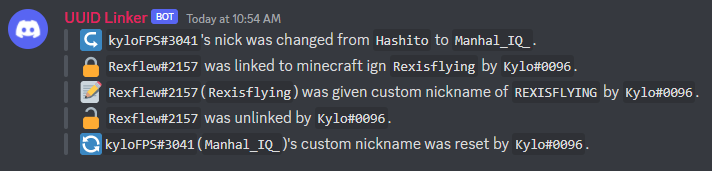

# UUID Linker Discord Bot
## By KyloFPS

This project is a discord bot that links players' discord nickname to their current Minecraft IGN, and it updates if they change their IGN.

## The problem it solves
I decided to create this project because Mojang removed their name change API and I felt like this would be a helpful bot to save the staff some time from having to get DMs from guild members requesting to have their nickname updated manually.
## Intended Use
I created this project with the intention of exclusively staff using it to link discord users with their minecraft account. In order to give staff permissions to use the bot, they must have the `manage_nicknames` permission in discord.

In addition, the bot must be placed higher in the role list than any player who it should be able to link.
## Features
- **`/link [discord_user] [minecraft_username]`** Adds a link between the minecraft uuid, the server, and the discord user's id, and instantly changes their nickname.
- **`/unlink [discord_user]`** Removes a linked player from the linked players database.
- **`/customnick [discord_user] [custom_nickname (optional)]`** Lets staff change the nickname of a player to correct capitalization or otherwise. If no custom nickname is provided, it is reset back to default.
- Every 10 minutes, every linked player has discord nickname updated if their minecraft IGN is changed.

## Nicknames
So, in The Abyss, if your discord username is the same as your minecraft IGN, your discord nick will be set to your ign with the capitalization changed.

The default for players with the same IGN as discord users is to swap the capitalization of the first letter, however in certain cases, this may look bad (iCEDOUTQUUUUIN?), so staff can choose a custom nickname for a username using `/customnick`. This custom nickname is only tied to the username, so if the player changes ign, it will go back to the default. 

When server members leave the discord servers, their custom nickname, if they have one, and their link to their uuid will be removed, so if they rejoin they will need to be re-linked.

## Logs
All commands are using discord's slash commands and are ephemeral (hidden to others), but if you would like to have logs, you can use `/channel [text_channel]` (*manage channels perm needed*) to choose where logs should be sent.

Logs include:
- Users being linked & Unlinked
- Custom nicknames being set
- Nicks automatically changing (from username changes)